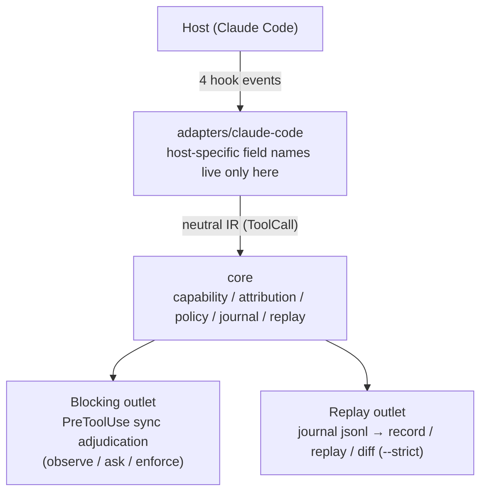

<div align="center">

<picture>
  <source media="(prefers-color-scheme: dark)" srcset="docs/hero-dark.svg">
  
</picture>

[](LICENSE)
[](https://en.cppreference.com/w/cpp/20)
[](https://code.claude.com/docs/en/plugins)
[](#doctor)
[](CONTRIBUTING.md)

**English** · [简体中文](README.zh-CN.md)

</div>

---

> **⚠️ warden is not a security boundary.** The best-effort regexes can be bypassed via `bash -c "$(...)"`, base64, `python -c`, and other indirect execution. v1 exists to **help honest skills show what they actually did** — not to stop malicious ones. Adversarial defense lands in v2 (sandboxing).

## Why warden

Installing a skill on your agent is a stack of verbal promises: "I only read files", "I only run git status". warden turns those promises into **verifiable runtime facts**:

| | |
|---|---|
| **Observe** | every tool call is recorded, with sanitized arguments |
| **Judge** | calls that exceed the skill's declared capabilities are blocked or surfaced per policy |
| **Replay** | trajectories can be replayed and diffed; skill drift shows up in CI |

## Quick Start

### Install

**Recommended — two commands, no build tools:**

```text
/plugin marketplace add Hans-wan/warden
/plugin install warden@warden
```

That's it. Hooks mount automatically and every session in any project is
covered. To see warden's status while you work, run `/warden:status` once —
it offers to add the one-line statusline to your status bar for you.

<details>
<summary>Build from source (manual wiring, CI images)</summary>

Requires CMake ≥ 3.20, Ninja, a C++20 compiler.

```bash
cmake -B build -G Ninja && cmake --build build
install -D build/warden <plugin-dir>/bin/darwin-arm64/warden   # linux-x64 on Linux
```

warden ships as a Claude Code plugin (`.claude-plugin/plugin.json` +
`hooks/hooks.json`) — hooks mount automatically, zero user configuration.
To wire it manually into one project instead, paste the generator output
into the `hooks` section of `.claude/settings.json`:

```bash
./build/warden gen-hooks   # prints hooks.json to stdout
```

</details>

### The four hooks

| Event | Subcommand | Sync/Async | Responsibility |
|---|---|---|---|
| `SessionStart` | `session-start` | sync | create session state, ensure journal dir, add `.warden/journal/` to `.gitignore` |
| `PreToolUse` | `pre-tool` | **sync** | adjudicate the call: allow / ask / deny |
| `PostToolUse` | `post-tool` | async | record a result summary (content never stored) |
| `Stop` | `stop` | async | turn boundary: demote turn-tier capabilities and persist |

> **No `SessionEnd` is declared** — it has a 1.5 s budget, too short to write out a trajectory, so it must not be a persistence path.

### 5-minute setup

```bash
# 1. Build
cmake -B build -G Ninja && cmake --build build

# 2. Declare policy in your project (optional; defaults to observe)
cat > .warden/policy.yaml <<'EOF'
default: observe
capabilities:
  fs:delete: ask        # deletion: ask first
  git:push: ask         # remote writes: ask first
  pkg:install: ask      # supply chain: ask first
  fs:write: enforce     # writes: hard block

skills:
  pdf-tools:
    capabilities: [fs:read, shell]
    persist: session    # this skill's turn-tier caps last for the session
EOF

# 3. Fill the skills: section with the real skill names and what they should be allowed to do

# 4. Attach the hooks (or install as a plugin and they mount automatically)
./build/warden gen-hooks

# 5. Use Claude Code normally. Afterwards, inspect the trajectory:
./build/warden record . <session-id>     # prints the trajectory's capability set
```

## Three modes

Policy lives in `.warden/policy.yaml` (relative to the project cwd); without it, the factory default is `default: observe`.

| Mode | Behavior |
|---|---|
| `observe` | record only, never interrupts |
| `ask` | hands the decision back to the user on violation (`permissionDecision: "ask"`) |
| `enforce` | rejects the call outright (`permissionDecision: "deny"`) |

Adjudication is a **union**: allowed capabilities = the union of all open scopes' declared capabilities. On rejection it names the offending capabilities and the likely responsible scopes:

```
capability fs:write not authorized by any open scope; responsible: [pdf-tools, …]
```

A skill absent from the `skills:` section gets `caps = {}` + `persist = false` (observe semantics).

**Tiered lifecycle**: capabilities split into turn-tier and session-tier. `fs:read` `git:read` `env:read` persist until session end; everything else expires at each `Stop` (turn boundary). A skill declared `persist: session` keeps its capabilities until the session ends.

## Trajectories & Replay

Trajectories land in `.warden/journal/<session_id>.jsonl` — **never committed to git** (written into `.gitignore` automatically; the journal contains command text). Redaction rules:

| Tool | What gets recorded |
|---|---|
| Bash | the command verbatim (the auditable core) |
| Write / Edit | path + content SHA-256 + byte count only, **never content** |
| Read | path only |
| MCP calls | argument key names + value hashes |
| Other tools | hash of the whole input |

```bash
warden record <root> <session-id>                          # print the trajectory's capability set
warden replay <root> <session-id> [--baseline <sid>]        # print trajectory report / diff
warden diff   <root> <base-sid> <target-sid> [--strict]     # three-layer diff
```

Comparison happens on three layers:

1. **Capability set** — deterministic, zero-noise, CI-assertable
2. **Tool sequence** — normalized edit distance
3. **Artifacts** — file paths and content hashes

### CI gate

`diff --strict` is the CI assertion: **the criterion is "no new capabilities"** (exit 0 = none, exit 1 = gained). It reads `addedCaps`, not the verdict string — on a mixed add+remove (gained A, lost B) the verdict is `drift` yet the trajectory did expand privilege; reading the verdict would miss it.

```yaml
# CI example
- run: warden diff . "$BASE_SID" "$NOW_SID" --strict
```

After upgrading a skill, run the same task once: any gained capability is a red light. The acceptance bar is "learned no new tricks", not "byte-identical" (exact trajectory equality is inherently flaky).

## Doctor

```bash
warden doctor [root]
```

A security tool that fails silently is worse than none. Four checks; any failure means the gate may be down:

- `hooks-configured` — reads `<root>/hooks/hooks.json`, verifies all four events reference warden
- `hook-fires` — feeds a synthetic payload to `pre-tool`, verifies the journal grows an event
- `hot-path-latency` — times that same call; fails above 100 ms (hard limit)
- `journal-writable` — appends a probe event to the journal and reads it back

## Architecture at a Glance



The core is a **capability taxonomy**: 10 core tags derived from structured fields or reliable parsing (`fs:read` `fs:write` `fs:delete` `git:read` `git:write` `git:push` `env:read` `net:fetch` `pkg:install` `shell`), 9 best-effort tags matched by regex and guaranteed incomplete (`net:listen` `proc:kill` `db:write` `cloud:admin` …). All tags: `src/core/capability/tags.h`.

## Boundaries & Known Limits

<details open>
<summary><strong>Not a security boundary</strong> — and four more things you should know</summary>

- **Not a security boundary** (see the statement up top). The 9 best-effort tags are regex-matched and will miss.
- **`/skillname` slash triggers produce no `Skill` tool call** — the `UserPromptExpansion` event is not wired; slash attribution is out of scope this version. Only the model-invoked `Skill` tool path is covered (key path `tool_input.skill`).
- **`@file` references bypass `PreToolUse`**: content referenced via `@file` in the prompt is injected with no tool call. The fallback is a `Read` deny rule shipped with the policy pack.
- **Multi-scope attribution is imprecise**: with several skills open, only the "set of likely responsible scopes" is reported — no false precision.
- **Privacy red line**: PostToolUse's `tool_response` (file contents, command output) never enters the journal; records carry only a summary. The journal is gitignored by default.

</details>

## Contributing

Contributions are welcome — every change lands through a reviewed pull request. See [CONTRIBUTING.md](CONTRIBUTING.md).

<div align="center">

[English](README.md) · **简体中文**

</div>
