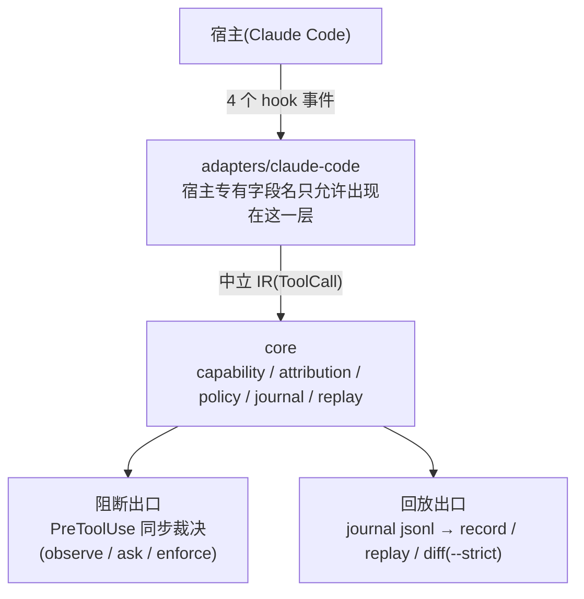

<div align="center">

<picture>
  <source media="(prefers-color-scheme: dark)" srcset="docs/hero-dark.svg">
  
</picture>

[](LICENSE)
[](https://en.cppreference.com/w/cpp/20)
[](https://code.claude.com/docs/en/plugins)
[](#doctor-自检)
[](CONTRIBUTING.md)

[English](README.md) · **简体中文**

</div>

---

> **⚠️ warden 不是安全边界。** 尽力集的正则可被 `bash -c "$(...)"`、base64、`python -c` 等间接执行绕过。v1 定位是"帮诚实的人看清 skill 干了什么",不是"挡住恶意的人"。对抗性防御在 v2(沙箱)。

## 为什么需要 warden

给 agent 装 skill,等于给它发了一串口头承诺:"我只读文件,我只跑 git status"。warden 把这些承诺变成**可验证的运行时事实**:

| 动词 | 含义 |
|---|---|
| **观测** | 每次工具调用都被记录(含脱敏后的参数) |
| **判定** | 调用越出 skill 声明的能力时,按策略阻断或转交用户 |
| **回放** | 轨迹可重放、可 diff,skill 行为漂移在 CI 里现形 |

## 快速开始

### 安装

**推荐 — 两条命令,无需本地构建:**

```text
/plugin marketplace add Hans-wan/warden
/plugin install warden@warden
```

安装即生效:hooks 自动挂载,所有会话都受保护。装完运行一次
`/warden:status`,若尚未配置状态条,Claude 会主动提出帮你配置。

<details>
<summary>从源码构建(手动接线 / CI 场景)</summary>

需要 CMake ≥ 3.20、Ninja、C++20 编译器。

```bash
cmake -B build -G Ninja && cmake --build build
install -D build/warden <插件目录>/bin/darwin-arm64/warden
```

若不走插件安装,也可把生成器输出粘进 `.claude/settings.json` 的
`hooks` 字段手动接线:

```bash
./build/warden gen-hooks   # hooks.json 打印到 stdout
```

</details>

### 四个钩子的分工

| 事件 | 子命令 | 同步/异步 | 职责 |
|---|---|---|---|
| `SessionStart` | `session-start` | 同步 | 建会话状态、确保日志目录、把 `.warden/journal/` 写进 `.gitignore` |
| `PreToolUse` | `pre-tool` | **同步** | 裁决本次调用:allow / ask / deny |
| `PostToolUse` | `post-tool` | 异步 | 记录工具结果摘要(内容绝不入库) |
| `Stop` | `stop` | 异步 | 回合边界:降级回合层能力并落盘 |

> **不声明 `SessionEnd`**——它只有 1.5 秒预算,写不完轨迹,不能作为持久化路径。

### 5 分钟上手

```bash
# 1. 构建
cmake -B build -G Ninja && cmake --build build

# 2. 在你的项目里声明策略(可选,不写则全部 observe)
cat > .warden/policy.yaml <<'EOF'
default: observe
capabilities:
  fs:delete: ask        # 删除:问一下
  git:push: ask         # 改远端:问一下
  pkg:install: ask      # 供应链:问一下
  fs:write: enforce     # 写入:硬拦

skills:
  pdf-tools:
    capabilities: [fs:read, shell]
    persist: session    # 该 skill 的回合层能力延续到会话结束
EOF

# 3. skills: 段写你实际要用的 skill 名与它该有的能力

# 4. 挂上钩子(或装成插件后自动挂载)
./build/warden gen-hooks

# 5. 正常使用 Claude Code。事后看轨迹:
./build/warden record . <session-id>     # 打印该轨迹的能力集
```

## 三档模式

策略文件 `.warden/policy.yaml`(相对项目 cwd),未写则出厂默认 `default: observe`。

| 档 | 行为 |
|---|---|
| `observe` | 只记录,从不打断 |
| `ask` | 越界时把决定交回用户(`permissionDecision: "ask"`) |
| `enforce` | 越界时直接拒绝(`permissionDecision: "deny"`) |

裁决用**并集**:允许的能力 = 所有开启作用域所声明能力的并集。拒绝时按分账格式列出越界能力与可能的责任方:

```
能力 fs:write 未被任何开启作用域授权;可能的责任方: [pdf-tools, …]
```

未在 `skills:` 段声明的 skill 一律 `caps = {}` + `persist = false`(observe 语义)。

**生命周期分层**:能力分回合层与会话层。`fs:read` `git:read` `env:read` 是持久层,保留到会话结束;其余能力在每次 `Stop`(回合边界)时过期。声明 `persist: session` 的 skill 例外——它的能力延续到会话结束。

## 轨迹与回放

轨迹落在 `.warden/journal/<session_id>.jsonl`,**默认不入 git**(已自动写进 `.gitignore`——日志含命令原文)。脱敏规则:

| 工具 | 记录内容 |
|---|---|
| Bash | 命令原文(可审计的关键) |
| Write / Edit | 仅路径 + 内容 SHA-256 + 字节数,**绝无内容** |
| Read | 仅路径 |
| MCP 调用 | 参数键名 + 值的哈希 |
| 其他 | 整体输入哈希 |

```bash
warden record <root> <session-id>                          # 打印该轨迹的能力集
warden replay <root> <session-id> [--baseline <sid>]        # 打印轨迹报告 / diff
warden diff   <root> <base-sid> <target-sid> [--strict]     # 三层 diff
```

轨迹比对分三层:

1. **能力集**——确定性、零噪音,可作 CI 断言
2. **工具序列**——归一化编辑距离
3. **产物**——文件路径与内容哈希

### CI 门禁

`diff --strict` 是 CI 断言:**判据是"没有新增能力"**(exit 0 = 无新增,exit 1 = 有新增)。不读 verdict 字符串——混合增减(新增 A 移除 B)时 verdict 是 `drift` 但确实是扩权,读 verdict 会漏判。

```yaml
# CI 示例
- run: warden diff . "$BASE_SID" "$NOW_SID" --strict
```

skill 升级后跑一遍同样的任务,新增能力即红灯。验收标准是"没学会新把戏",而不是"每个字符都一样"(轨迹全等必然 flaky)。

## doctor 自检

```bash
warden doctor [root]
```

一个会静默失效的安全工具比没有更危险。doctor 四项检查,任何一项失败都意味着闸门可能失效:

- `hooks-configured` — 读 `<root>/hooks/hooks.json`,确认四事件齐全且引用 warden
- `hook-fires` — 用合成 payload 喂一次 `pre-tool`,确认 journal 真的长出事件
- `hot-path-latency` — 同一次调用实测耗时,超 100ms(硬上限)失败
- `journal-writable` — 向 journal 追加一条 probe 事件并读回

## 架构一瞥


核心是**能力分类法**:10 个核心标签走结构化字段或可靠解析(`fs:read` `fs:write` `fs:delete` `git:read` `git:write` `git:push` `env:read` `net:fetch` `pkg:install` `shell`),9 个尽力集标签靠正则识别、必然漏判(`net:listen` `proc:kill` `db:write` `cloud:admin` 等)。所有能力标签见 `src/core/capability/tags.h`。

## 边界与已知限制

<details open>
<summary><strong>不是安全边界</strong>——以及另外四件你需要知道的事</summary>

- **不是安全边界**(见首屏声明)。尽力集 9 个标签靠正则识别,必然漏判。
- **`/skillname` slash 触发不产生 `Skill` 工具调用**——`UserPromptExpansion` 事件尚未接线,本版不实现 slash 归属。只覆盖模型自行调用 `Skill` 工具的路径(键路径 `tool_input.skill`)。
- **`@file` 引用绕过 `PreToolUse`**:prompt 里 `@file` 引入的内容不经任何工具调用即注入。兜底是策略包里的 `Read` deny 规则,随策略包一起分发。
- **多作用域无法精确归因**:同时开启的多个 skill 只报"可能的责任方集合",不假装精确。
- **隐私红线**:PostToolUse 的 `tool_response`(文件内容、命令输出)绝不入库;记录里只有摘要。日志默认写进 `.gitignore`。

</details>

## 参与贡献

欢迎外部贡献——所有改动一律通过 Pull Request 提交,经维护者审核后合并。见 [CONTRIBUTING.md](CONTRIBUTING.md)。

<div align="center">

[English](README.md) · **简体中文**

</div>
